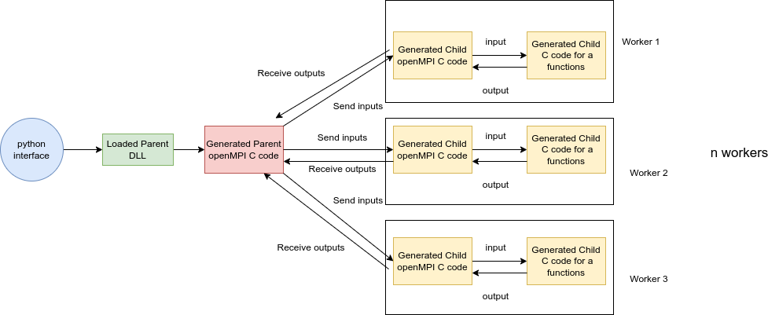
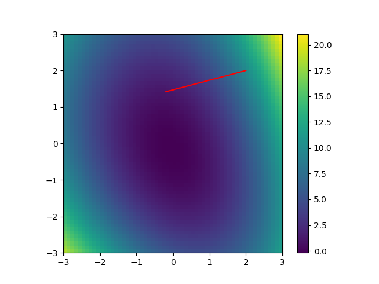
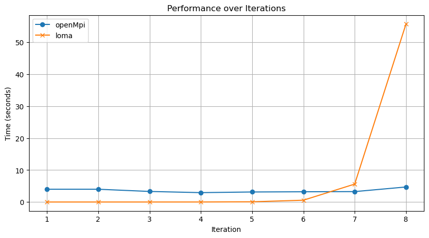

# Distributed Automatic Differentiation with OpenMPI Support for Loma



## Table of Contents
1. [Abstract](#abstract)
2. [Key Features](#key-features)
3. [Architecture Overview](#architecture-overview)
4. [Implementation Highlights](#implementation-highlights)
5. [Experiments and Results](#experiments-and-results)
6. [Limitations and Future Work](#limitations-and-future-work)
7. [Project Structure](#project-structure)
8. [Getting Started](#getting-started)
9. [Contributors](#contributors)

## Abstract

This project enhances the Loma compiler by integrating OpenMPI (Open Message Passing Interface) support, enabling distributed and parallelized automatic differentiation across multiple machines. By leveraging the computational power of distributed systems, we significantly improve compilation speed and efficiency, particularly for large datasets and complex functions.

## Key Features

- OpenMPI integration for distributed processing
- Parent-child architecture for efficient task distribution
- Support for both forward and reverse differentiation
- Scalable performance for large input sizes
- Compatibility with existing Loma test cases

## Loma OpenMPI Extension Architecture

The OpenMPI extension of Loma is supported by the implementation described below:

1. **Parser Codebase Extension**:

   - The parser codebase has been extended to support another decorator `@openMPI`. If this decorator is found, the parser sets a parameter as `is_openMPI` to `true` in the `FunctionDef`.

2. **Compiler Codebase Modification**:

   - If a `FunctionDef` is found, it generates two different C files: one which acts as a parent and the other which acts as a child.

3. **Parent Codebase Compilation**:

   - The parent codebase is compiled as a DLL (shared library) and can be loaded easily in Python. The main purpose of the parent is to spawn `n` (present as a parameter to the parent function) child workers which will execute the function. Additionally, the parent will send all the required parameters to the child processes and gather and receive the output from the child processes. This gathered output is what is sent back to the Python interface.

4. **Child Codebase Compilation**:
   - The child codebase is compiled as a regular object file. This is necessary as OpenMPI parallelization can only be invoked in files which have a `main` function. This child codebase additionally contains a wrapper on top of the concerned function which receives the parameters from the parent and sends back the response to the parent.
     
## Architecture Overview

The Loma OpenMPI extension introduces a sophisticated parent-child architecture:

1. **Parser Extension**: Added support for `@openMPI` decorator
2. **Compiler Modification**: Generates parent and child C files
3. **Parent Process**: Compiled as a DLL, manages child workers and data distribution
4. **Child Process**: Compiled as an object file, executes the actual function with OpenMPI wrapper

## Implementation Highlights

- **Codegen_openMPI.py**: Manages OpenMPI operations across parent and child nodes
- **Data Distribution**: Efficient splitting and transmission of input data
- **Result Aggregation**: Combines outputs from child nodes
- **Type Handling**: Supports various data types and array structures
- **Parallel Processing**: Enables multiple test inputs to be processed simultaneously

## Experiments and Results

### 1. Optimization of Multivariate Polynomial



Demonstrated system robustness by optimizing a third-order multivariate polynomial using gradient descent with automatic differentiation.

### 2. Performance Comparison


- OpenMPI implementation outperforms sequential execution for large input sizes (>10^8)
- Significant performance gains observed with increasing iteration counts

## Limitations and Future Work

1. Single Function OpenMPI Conversion
2. Single Execution Environment
3. Limited Support for Arrays

Future work includes addressing these limitations and further optimizing the system for diverse use cases.

## Project Structure

```
MPICompiler/
├── Final_Code/
    ├── documentation/
    │   ├── Checkpoint.pdf
    │   ├── OpenMPIInstall.pdf
    │   ├── OpenMPI_Compiler.pdf
    │   └── Project_Proposal.pdf
    ├── experiments/
    │   ├── multiple_input_time_experiment.py
    │   ├── resource_comparison.py
    │   ├── time_analysis.ipynb
    │   └── time_comparison.py
    ├── loma_code/
    │   ├── array_in_struct.py
    │   ├── array_input.py
    │   ├── array_input_indexing.py
    │   ├── array_input_indexing_rev.py
    │   ├── array_input_rev.py
    │   ├── array_output.py
    │   ├── array_output_indexing.py
    │   ├── array_output_rev.py
    │   ├── assign.py
    │   ├── assign1_rev.py
    │   ├── assign2_rev.py
    │   ├── assign3_rev.py
    │   ├── assign4_rev.py
    │   ├── assign5_rev.py
    │   ├── assign_args_rev.py
    │   ├── call.py
    │   ├── call_cos.py
    │   ├── call_cos_rev.py
    │   ├── call_exp.py
    │   ├── call_exp_rev.py
    │   ├── call_log.py
    │   ├── call_log_rev.py
    │   ├── call_pow.py
    │   ├── call_pow_rev.py
    │   ├── call_rev.py
    │   ├── call_sin.py
    │   ├── call_sin_rev.py
    │   ├── call_sqrt.py
    │   ├── call_sqrt_rev.py
    │   ├── constant.py
    │   ├── constant_rev.py
    │   ├── declare.py
    │   ├── declare_rev.py
    │   ├── divide.py
    │   ├── divide_rev.py
    │   ├── identity.py
    │   ├── identity_rev.py
    │   ├── int_array_input.py
    │   ├── int_array_input_rev.py
    │   ├── int_assign_rev.py
    │   ├── int_input.py
    │   ├── int_input_rev.py
    │   ├── int_output.py
    │   ├── int_output_rev.py
    │   ├── multiple_outputs.py
    │   ├── multiply.py
    │   ├── multiply_rev.py
    │   ├── nested_struct_input.py
    │   ├── nested_struct_output.py
    │   ├── plus.py
    │   ├── plus_rev.py
    │   ├── poly.py
    │   ├── refs_out_rev.py
    │   ├── side_effect.py
    │   ├── square_rev.py
    │   ├── struct_assign.py
    │   ├── struct_declare.py
    │   ├── struct_in_array.py
    │   ├── struct_input.py
    │   ├── struct_output.py
    │   ├── subtract.py
    │   ├── subtract_rev.py
    │   ├── third_order_poly_fwd.py
    │   └── while.py
    ├── plots/
    │   ├── architecture.png
    │   ├── third_order_optimize_poly.png
    │   ├── time_analysis1.png
    │   └── time_analysis2.png
    └── tests/
        ├── forward_test.py
        ├── optimize_poly_fwd.py
        └── reverse_test.py
```

## Getting Started

1. Install OpenMPI following the guide in `Final_Code/documentation/OpenMPIInstall.pdf`
2. Clone the repository: `https://github.com/jash6/MPICompiler.git`
3. Navigate to the project directory: `cd OpenMPI_Compiler`
4. Run tests: `python tests/forward_test.py` and `python tests/reverse_test.py`

For detailed setup and usage instructions, refer to `MPICompiler/Final_Code/documentation`.

For more information regarding Loma, refer to `handouts/homework0.tx`

## Contributors
- Jash Gautam Makhija
- Animesh Kumar

This project demonstrates the potential of integrating OpenMPI with automatic differentiation frameworks, enhancing computational efficiency and scalability for various applications in scientific computing and machine learning.
